### Fed4.pic

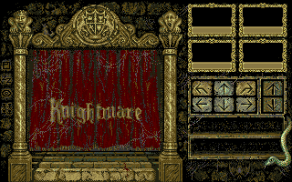{:width="640" height="400"} 
Main screen graphic, including the curtains.
{:.center}

### Fed5.pic

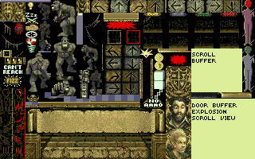{:width="640" height="400"} 
Spritesheet for main screen UI graphics, 
{:.center}

### Fed8.pic

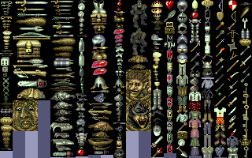{:width="640" height="400"} 
Spritesheet for weapons and items.
{:.center}

### KMAln-A.pic

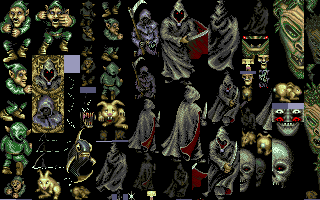{:width="640" height="400"} 
Monster spritesheet.
{:.center}

### KMAln-B.pic

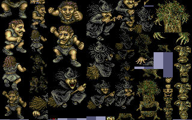{:width="640" height="400"} 
Monster spritesheet.
{:.center}

### KMAln-C.pic

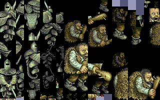{:width="640" height="400"} 
Monster spritesheet.
{:.center}

### KMAln-D.pic

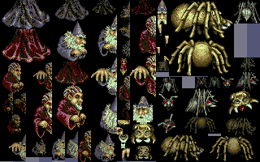{:width="640" height="400"} 
Monster spritesheet.
{:.center}

### KMAln-E.pic

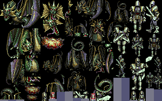{:width="640" height="400"} 
Monster spritesheet.
{:.center}

### KMAln-F.pic

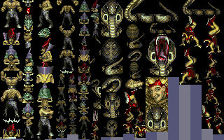{:width="640" height="400"} 
Monster spritesheet.
{:.center}

### kmaln-g.pic

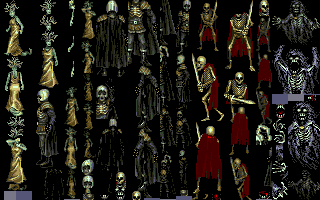{:width="640" height="400"} 
Monster spritesheet.
{:.center}

### kmaln-h.pic

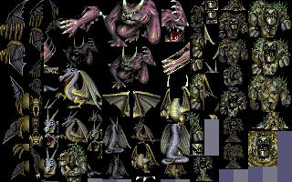{:width="640" height="400"} 
Monster spritesheet.
{:.center}

### KMDoor-A.pic

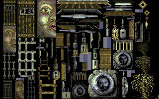{:width="640" height="400"} 
Door graphics, Treguard, keyholes, ladders, etc.
{:.center}

### KMDoor-B.pic

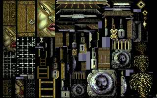{:width="640" height="400"} 
Variant door style. Most tiles repeated from KMDoor-A.
{:.center}

### kmroof.pic

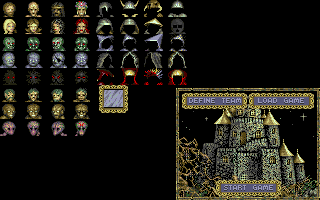{:width="640" height="400"} 
Party sprites and the "start game" graphic. No idea why it's called "roof".
{:.center}

### KMShop-A.pic

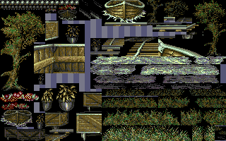{:width="640" height="400"} 
World graphics, including grass, minecart, trees, water. No idea why it's called
"Shop".
{:.center}

### KMShop-B.pic

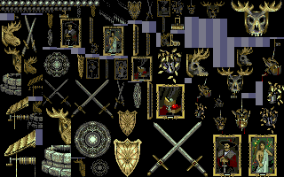{:width="640" height="400"} 
Various wall decorations. Paintings, crossed swords, mounted animal heads.
{:.center}

### KMWall-A.pic

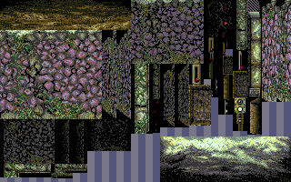{:width="640" height="400"} 
Walls used in the outdoor area.
{:.center}

### KMWall-B.pic

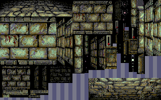{:width="640" height="400"} 
Walls used in the first dungeon.
{:.center}

### KMWall-C.pic

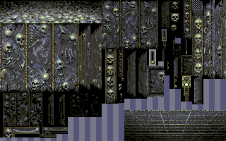{:width="640" height="400"} 
Walls used in the second dungeon style.
{:.center}

### KMWall-D.pic

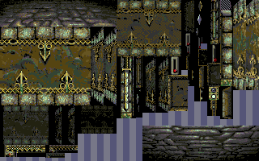{:width="640" height="400"} 
Walls used in the third dungeon style.
{:.center}

### KMWall-E.pic

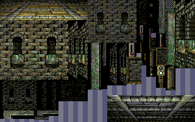{:width="640" height="400"} 
More walls.
{:.center}

### min001

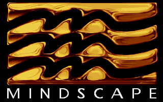{:width="640" height="400"} 
Mindscape logo, the publisher.
{:.center}

### min002

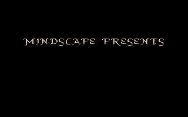{:width="640" height="400"} 
"Mindscape presents"
{:.center}

### min003

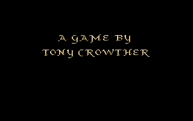{:width="640" height="400"} 
"A game by Tony Crowther"
{:.center}

### min2001

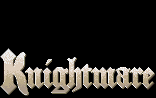{:width="640" height="400"} 
"Knightmare"
{:.center}

### min2002

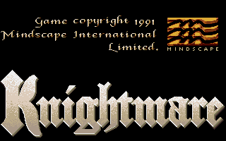{:width="640" height="400"} 
"Game copyright 1991 Mindscape International Limited". Re-uses the Knightmare
graphic from min2001, very inefficient.
{:.center}

### min2003

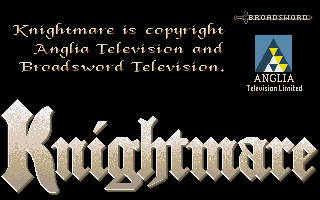{:width="640" height="400"} 
"Knightmare is copyright Anglia Television and Broadsword Television."
{:.center}

### min2004

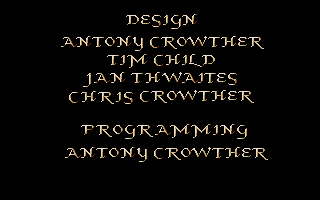{:width="640" height="400"} 
Credits. Antony Crowther is the sole programmer. His brother Chris Crowther
is also credited on design. Artist Jan Thwaites and Knightmare TV series creator
Tim Child also receive design credits.
{:.center}

### min2005

{:width="640" height="400"} 
Credits. Director: Phil Harrison. Producer: Steve Whittle.
{:.center}

### min2006

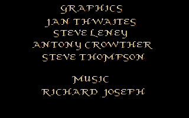{:width="640" height="400"} 
Credits. Graphics: Jan Thwaites, Steve Leney, Antony Crowther, Steve Thompson.
Music: Richard Joseph.
{:.center}

### min2007

{:width="640" height="400"} 
Credits.
{:.center}

### nox001

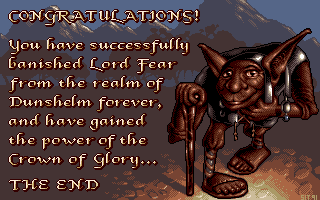{:width="640" height="400"} 
Win screen. It's a static screen. Not sure why it's called "nox".
{:.center}

### nox002

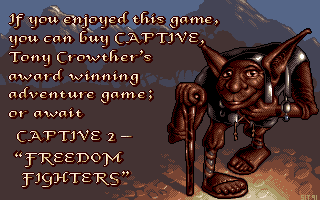{:width="640" height="400"} 
Second frame of win screen. It reproduces the identical background art instead
of writing over it with the text as a a bitmap font. Advertises Crowther's
previous game Captive, and the upcoming sequel "Captive 2: Freedom Fighters",
which was actually released as "Liberation: Captive 2".
{:.center}

### seg5a

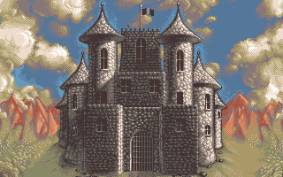{:width="640" height="400"} 
Castle graphic in the intro.
{:.center}

### seg0, seg1, seg2, seg3

Animation used for each of the four quest items, not yet ripped.

### seg5b

Animation used in the intro, not yet ripped.

### SEG4

A very large file on disk 2 containing graphics and animation used in the main
game.
