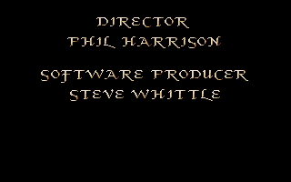

### Fed4.pic

{:width="640" height="400"} 
Main screen
{:.center}

Main screen graphic, including the curtains which open and close during the
loading screen. The tradition of naming graphics files "fed" goes back to
_Captive_; i.e. see
[Disk Directory](https://captive.atari.org/Technical/Directory/Directory.php)
at the Ultimate Captive Guide.

### Fed5.pic

{:width="640" height="400"} 
Main screen UI
{:.center}

Spritesheet for the main screen UI graphics, plus a monster. Also includes two
buffer areas for internal game use: a 64 x 55 scroll buffer, and an 80 x 76
buffer for explosions, etc. 80 x 76 is the height of the explosion graphic;
see [Ripped graphics (internal)](../data/internal-graphics.html).
One monster is also here.

### Fed8.pic

{:width="640" height="400"} 
Weapons and items
{:.center}

Spritesheet for weapons, items, and talking with certain monsters.

### KMAln-A.pic

{:width="640" height="400"} 
Monster spritesheet
{:.center}

Certain monsters only have half of their sprite drawn, to save space. The other
half of the face is drawn flipped from the sprite. A complaint about the skull
is that it always appears to be facing forward, which makes it hard to use the
strategy of sneaking around the back.

### KMAln-B.pic

{:width="640" height="400"} 
Monster spritesheet
{:.center}

### KMAln-C.pic

{:width="640" height="400"} 
Monster spritesheet
{:.center}

### KMAln-D.pic

{:width="640" height="400"} 
Monster spritesheet
{:.center}

### KMAln-E.pic

{:width="640" height="400"} 
Monster spritesheet
{:.center}

### KMAln-F.pic

{:width="640" height="400"} 
Monster spritesheet
{:.center}

### kmaln-g.pic

{:width="640" height="400"} 
Monster spritesheet
{:.center}

### kmaln-h.pic

{:width="640" height="400"} 
Monster spritesheet
{:.center}

### KMDoor-A.pic

{:width="640" height="400"} 
Dungeon graphics
{:.center}

Door graphics, Treguard, keyholes, ladders.

### KMDoor-B.pic

{:width="640" height="400"} 
Dungeon graphics
{:.center}

Variant dungeon style. Most tiles repeated from KMDoor-A.

### kmroof.pic

{:width="640" height="400"} 
Team graphics
{:.center}

Party sprites and the "start game" graphic. No idea why it's called "roof".
There are unique sprites for all four party members of all eight races, and
matching overlays for all five classes aside from Adventurer, which uses no
overlay.

### KMShop-A.pic

{:width="640" height="400"} 
World graphics
{:.center}

World graphics, including grass, red flowers, minecart, trees, water. No idea
why it's called "Shop".

### KMShop-B.pic

{:width="640" height="400"} 
World graphics
{:.center}

Various wall decorations. Paintings, crossed swords, mounted animal heads.

### KMWall-A.pic

{:width="640" height="400"} 
Walls, outdoor area
{:.center}

### KMWall-B.pic

{:width="640" height="400"} 
Walls, first dungeon
{:.center}

### KMWall-C.pic

{:width="640" height="400"} 
Walls, second dungeon
{:.center}

### KMWall-D.pic

{:width="640" height="400"} 
Walls, third dungeon
{:.center}

### KMWall-E.pic

{:width="640" height="400"} 
Walls, fourth dungeon
{:.center}

### min001

{:width="640" height="400"} 
Mindscape logo, the publisher
{:.center}

### min002

{:width="640" height="400"} 
"Mindscape presents"
{:.center}

### min003

{:width="640" height="400"} 
"A game by Tony Crowther"
{:.center}

### min2001

{:width="640" height="400"} 
"Knightmare"
{:.center}

### min2002

{:width="640" height="400"} 
"Game copyright 1991 Mindscape International Limited".
{:.center}

Re-uses the Knightmare graphic from min2001, very inefficient on storage but
easier to code.

### min2003

{:width="640" height="400"} 
"Knightmare is copyright Anglia Television and Broadsword Television."
{:.center}

### min2004

{:width="640" height="400"} 
Credits
{:.center}

Antony Crowther is the sole programmer. His brother Chris Crowther is also
credited on design. Artist Jan Thwaites and Knightmare TV series creator Tim
Child also receive design credits.

### min2005

{:width="640" height="400"} 
Credits
{:.center}

Director: Phil Harrison. Producer: Steve Whittle.

### min2006

{:width="640" height="400"} 
Credits.
{:.center}

Graphics: Jan Thwaites, Steve Leney, Antony Crowther, Steve Thompson. Music:
Richard Joseph.

### min2007

{:width="640" height="400"} 
Credits
{:.center}

### nox001

{:width="640" height="400"} 
Win screen
{:.center}

It's a static screen. Not sure why it's called "nox".

### nox002

{:width="640" height="400"} 
Win screen
{:.center}

Second frame of win screen. It reproduces the identical background art instead
of writing over it with the text as a a bitmap font. Advertises Crowther's
previous game Captive, and the upcoming sequel "Captive 2: Freedom Fighters",
which was actually released as "Liberation: Captive 2".

### seg5a

{:width="640" height="400"} 
Castle graphic in the intro
{:.center}

### seg0, seg1, seg2, seg3

Animation used for each of the four quest items, not yet ripped.

### seg5b

Animation used in the intro, not yet ripped.

### SEG4

A very large file on disk 2 containing graphics and animation used in the main
game.

See also: [Ripped graphics (internal)](../data/internal-graphics.html)
