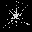
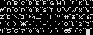

The main game executable `federation` includes some graphics built in, rather
than held in external files. They're generally 1-bit or 2-bit graphics with no
palette information, so the game can draw them with whichever palette it needs.

Each sprite is prefixed with four bytes, which communicate the number of frames
in each image and the number of bitplanes used. They're listed below by their
location in the file.

### $14CDA

{:width="160" height="152"} 
Explosion
{:.center}

### $152CE

{:width="160" height="152"} 
Splash
{:.center}

A water or magic effect or something.

### $158C2

{:width="192" height="32"} 
Fade
{:.center}

A 16 x 16, 1-bit six-frame fade effect.

### $15986

{:width="64" height="64"} 
Fireball
{:.center}

### $15A8E

{:width="64" height="64"} 
Splat
{:.center}

### $15B8E

{:width="64" height="64"} 
Twinkle
{:.center}

### $15C92

{:width="64" height="64"} 
Small explosion
{:.center}

### $15D96

{:width="64" height="64"} 
A rock?
{:.center}

### $15E9A

{:width="64" height="64"} 
A bird?
{:.center}

### $15F9E

{:width="256" height="32"} 
{:width="32" height="32"} 
Special effect
{:.center}

A 1-bit 8 frame zooming animation.

### $160A2, $16124

{:width="96" height="42"} {:width="96" height="42"} 
Panel opening animation
{:.center}

A three-frame, 16 x 21 animation for slide-opening panels. The second image
appears to be a graphic mask for the same efect.

### $161A6

{:width="64" height="64"} 
Noise pattern
{:.center}

Originally used in _Captive_ for monitors of offline devices. 

### $1622A

{:width="32" height="32"} 
Mouse pointer
{:.center}

The game's mouse pointer, a 16 x 16 image with 4 bitplanes. For simplicity this
image has been created from a screenshot in an emulator.

### $162AE

{:width="208" height="80"} 
Font
{:.center}

The main text font for the game, stored as 1-bit 8 x 8 graphics. The dots at the
top row of each font are not shown, and are presumably included for spacing
purposes. The "^" has been replaced with a "kg" symbol (same as _Captive_) and
the characters "&lt;=&gt;" are arrows and what looks like the top of a skull.

### $164BE

{:width="64" height="64"} 
Gradient
{:.center}

Identical to a graphic in _Captive_, according to
[The Ultimate Captive Guide](https://captive.atari.org/Technical/InternalGfx/InternalGfx.php).
Its purpose is unknown.

See also: [Ripped graphics (files)](../data/graphics.html)
