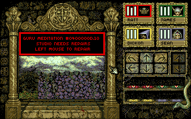

### Reduced party

If you start the game with fewer than four party members, it will make the death
sound as if the missing members have just died.

### Guru error

{:width="640" height="400"} 
GURU MEDITATION #0400000D.10 - STUDIO NEEDS REPAIRS - LEFT MOUSE TO REPAIR
{:.center}

Two AmigaDOS-style error messages appear in the game code:

> GURU MEDITATION #80010000.00 
> OUT OF MEMORY ERROR 
> LEFT MOUSE TO BOOT

> GURU MEDITATION #0400000D.10 
> STUDIO NEEDS REPAIRS 
> LEFT MOUSE TO REPAIR

In [The CRPG Addict's playthrough](https://crpgaddict.blogspot.com/2016/11/knightmare-almost-awake.html),
the second error "STUDIO NEEDS REPAIRS" appeared. I was also able to trigger it
completely be accident, simply by waiting around in the game's starting area. It
seems to be a legitimate bug handler rather than just an easter egg, but it's
currently unclear what triggers the bug. It also reportedly appeared in
_Captive_.

My current guess is that the game state becomes corrupted somehow, such as a
monster moving out of bounds. Memory comparison before and after clicking shows
a lot of changes to the memory locations responsible for game map, so it may be
a function to detect and repair a corrupted game map.
