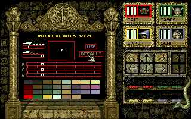

### Throwing multiple items

When you throw a weapon from the hand, it will automatically be replaced by one
from the backpack, if you have one.

For example, if you have one Ball in hand and two Balls in your backpack, if you
throw your Ball it will immediately take one from the character's backpack and
put it into your hand.

### Atari ST palette

In the Preferences window, click on the right-hand side of the "DEFAULT" button
to switch to an alternate darker palette. Click the left side to return to the
default palette.

{:width="320" height="200"}{:width="320" height="200"} 
Left: Default palette. Right: Alternate palette.
{:.center}

The alternate palette appears to be the 16-color palette used for the Atari ST
version of Knightmare. The Amiga version of the game is 32 colors.
