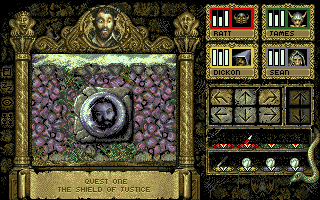

According to Backdoor Cheats, 5 April 1995, there is a cheat in Knightmare:

> This cheat involves the woodland section on the first level. Use the spade to
> help you find the five apples. Take these apples and throw them at the quest
> sheild that hangs on the wall, and make each character consume two rabbit pies
> from the inventory screen. Continue with your quest and you should find that
> your hit points never decreased.

### Is it real?

Testing it by memory-editing in apples and rabbit pies appears to show that the
cheat is completely fake. While I haven't fully verified it yet in the game
code, this cheat appears to be false.

### Source

_Games-X_ magazine, 26 March to 1 April 1992, page 28, featured the earliest
known version of this cheat:

> Nice little tip this one from a Mr Uli Ingit from Scunthorpe who has
> apparently been playing the game since it was first released. The cheat
> involves the woodland section on the first level. Search for the spade in
> order to find the apples and then take five of them to the shield that hangs
> on the wall.
>
> Throw all five apples into the quest shield and then make each character
> consume two rabbit pies from the inventory screen. Now continue with your
> quest and you should find tha your hit points never go down!

The language used clearly shows that this is an ancestor of the popularly
circulated version; e.g. "involves the woodland section on the first level".

Given that it's the magazine's April 1st issue, it seems likely that this was a
fake. The submitter's name is also a clue: "Uli Ingit" = "U lie, innit".

The cheat nevertheless circulated to other magazines. _Zero_ issue 34, August
(1992, at best guess), page 56:

> Here's a bit of a tip to make this game less of a nightmare to play (not that
> it is a nightmare in the first place, you understand). Er... anyway, in the
> woods on the first section, use your spade to find five apples. Take the
> apples and hurl them at the quest shield on hanging on the wall, then make
> each of your group eat two rabbit pies from the inventory screen - whether
> they like them or not! Now your hit points won't sap your energy levels.

_The One_ May 1995, page 72, repeated the cheat, exactly as worded in _Backdoor_
but with correct spelling:

> This cheat involves the woodland section on the first level. Use the spade to
> help you find the five apples. Take these apples and throw them at the quest
> shield that hangs on the wall, and make each character consume two rabbit pies
> from the inventory screen. Continue with your quest and you should find that
> your hit points never decrease.

Note how it's slightly re-worded from the _Games-X_ version, erroneously
interpreting that there are only five apples in the section.

{:width="640" height="400"}

The phrase "quest shield" presumably refers to the Treguard thing on the wall
in the woodland area, which reads "Quest One: The Shield of Justice".
