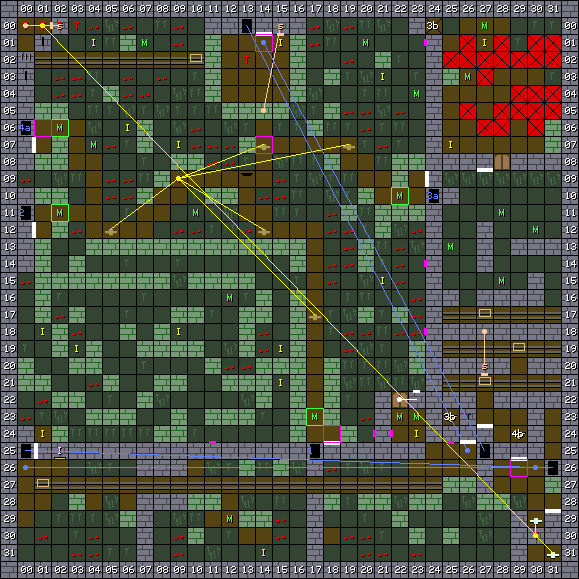
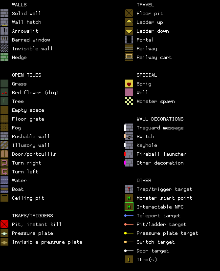

This is the initial map of _Knightmare_. See the [notes](#notes) below for
introductory details about the game's level layout.

1. Table of Contents
{:toc}

### Map

### Key

### Wall messages

 Coords      | Message                 
-------------|-------------------------
 X: 00 Y: 07 | QUEST FOUR THE CROWN OF GLORY
 X: 00 Y: 12 | QUEST TWO THE CUP OF LIFE
 X: 01 Y: 25 | YOUR CARRIAGE AWAITS YOU
 X: 14 Y: 00 | YOUR QUEST STARTS HERE
 X: 18 Y: 25 | QUEST ONE THE SHIELD OF JUSTICE
 X: 24 Y: 09 | QUEST THREE THE SWORD OF FREEDOM
 X: 26 Y: 24 | TAKE THIS SHORT CUT TO THE FOREST
 X: 27 Y: 08 | BEWARE THE SWAMP
 X: 27 Y: 24 | ENJOY YOUR RIDE
 X: 29 Y: 25 | WELCOME TO YOUR KNIGHTMARE
 X: 31 Y: 29 | RETURN THE CROWN HERE

### Items

 Coords      | Item       
-------------|------------
 X: 01 Y: 18 | 22: SWEET
 X: 01 Y: 24 | 5f: IRON KEY
 X: 02 Y: 25 | 41: BALL (x3)
 X: 03 Y: 19 | 09: T-SHIRT
 X: 04 Y: 01 | 22: SWEET
 X: 06 Y: 06 | 22: SWEET
 X: 09 Y: 07 | 13: SHORTS
 X: 09 Y: 18 | 1b: SANDLES
 X: 14 Y: 31 | 09: T-SHIRT (x2), 13: SHORTS (x3), 1b: SANDLES
 X: 15 Y: 01 | 47: TWIG
 X: 15 Y: 19 | 22: SWEET
 X: 15 Y: 21 | 30: PENKNIFE
 X: 21 Y: 03 | 30: PENKNIFE
 X: 21 Y: 15 | 22: SWEET
 X: 23 Y: 24 | 48: SPADE
 X: 25 Y: 07 | 24: APPLE (x2)
 X: 27 Y: 01 | 24: APPLE (x2)

### NPCs

 Coords      | Monster              | Defeated by            | Drops                  | Text
-------------|----------------------|------------------------|------------------------|--------
 X: 02 Y: 06 | 01: Tree             | 39: SWORD OF FREEDOM   |                        | I HAVE LOST MY WEAPON
 X: 02 Y: 11 | 01: Tree             | 46: SHIELD OF JUSTICE  |                        | I HAVE LOST MY COVER
 X: 17 Y: 23 | 01: Tree             | 47: TWIG               | 4b: WAND OF MAGIC      | I HAVE LOST MY CHILD
 X: 22 Y: 10 | 01: Tree             | 5d: CUP OF LIFE        |                        | HAVE YOU SEEN MY CUP?

### Monsters

 Coords      | Monster              | HP     | Number
-------------|----------------------|--------|--------
 X: 02 Y: 06 | 01: Tree             |  2,000 | 1
 X: 02 Y: 11 | 01: Tree             |  1,000 | 1
 X: 04 Y: 07 | 00: Goblin           |     12 | 1
 X: 07 Y: 01 | 00: Goblin           |     10 | 1
 X: 10 Y: 11 | 00: Goblin           |     23 | 1
 X: 12 Y: 16 | 00: Goblin           |     50 | 1
 X: 12 Y: 29 | 03: Troll            |     70 | 1
 X: 17 Y: 23 | 01: Tree             |  1,000 | 1
 X: 20 Y: 01 | 08: Pooka            |     10 | 1
 X: 22 Y: 10 | 01: Tree             |  1,000 | 1
 X: 22 Y: 23 | 03: Troll            |  1,300 | 2
 X: 23 Y: 04 | 00: Goblin           |     20 | 1
 X: 23 Y: 23 | 03: Troll            |  4,300 | 2
 X: 25 Y: 13 | 20: Earth elemental  |    300 | 1
 X: 26 Y: 03 | 20: Earth elemental  |    235 | 4
 X: 27 Y: 00 | 20: Earth elemental  |    235 | 4
 X: 28 Y: 11 | 20: Earth elemental  |    300 | 1
 X: 28 Y: 15 | 20: Earth elemental  |    300 | 1
 X: 30 Y: 12 | 20: Earth elemental  |    300 | 1

### Notes

There are eight maps in the game. Each is a 32 x 32 square area, automatically
surrounded by solid walls on all sides. The starting forest area is one map, and
each of the four quests (Shield, Sword, Cup and Crown) consist of one or more
maps each.

All blocks take up a solid square. For example, the starting area appears to
have two portals, one blocked by a hedge. In fact, they are just the same portal
block viewed from different sides. Walls also occupy a full square. However,
some blocks have something on one side, such as an item hatch, lever, message
from Treguard, or a decoration.

The player starts the game on Map 0 at coordinates X: 19 Y: 26, facing south.
The maps on this site are extracted from the game data and make the assumption
that the top of the map is north; i.e. the coordinate X: 0 Y: 0 is top left, or
northeast. (Quido's Excel spreadsheet maps take the opposite direction as north,
so they're rotated 180 degrees.)

Additional start points are marked on the map where the player returns to the
forest from other maps, such as by teleporter, pit, or ladder. The mysterious
square hole in the sky, seen at X: 13 Y: 09, is how the player returns from the
Shield quest, at coordinates X: 30 Y: 30 of that map.

The sign "ENJOY YOUR RIDE" mysteriously appears to face west in the map data
(block type 08), but renders correctly facing south in the game.

A portal at the other end of the minecart line sends you to the north of the
main forest area. The trigger at X: 13 Y: 02 is a mystery, as no switch sets it;
the lever actually opens a gap in the hedge directly south.

This opens into a main area which primarily serves as a hub for the four main
quests: Shield, Cup, Sword, and Crown. The dirt paths will guide you to them,
but five invisible pressure plates located at points on the dirt paths will
spawn a rabbit at X: 09 Y: 09. You can actually see the rabbit spawn in if you
move quickly enough. The rabbits serve as an apparently unlimited supply of
food.

If the right-hand section of the map seems unfamiliar, that's because it's
inaccessible from the forest area. Instead, the final Crown quest incorporates
segments stored in otherwise unused sections of other maps. A ladder from the
second Crown quest level leads to Forest X: 29 Y: 24. The block at X: 26 Y: 23
beside a sign reading "BEWARE THE SWAMP" is cleared by a switch on the second
Sword level (part of the Crown quest) between two spinners that rotate the
player clockwise and inside a fake wall.

Another interesting feature of the Forest map is the top left corner, which is
completely blocked off. This may be to prevent monsters wandering into
coordinates X: 00 Y: 00, since zeroes are also used to mark empty monster slots,
so a monster who enters 0,0 might disappear. This may also be why there is a
minecart rail blocking off that section. There's nothing special inside the
top-left corner, but there is a switch on the left side which targets 0,0, and
various other trigger references; technically, the trigger to win the game is on
X: 02 Y: 00. The location may not be intended to be taken literally.

An iron key in the Forest opens the door on the bottom-right which contains very
high hit points. The spade acquired here can be equipped to dig red flower
patches for apples, but since the rabbits can be generated indefinitely, there's
not much point.

The tree guardians which gatekeep the four quests are not actually invulnerable
to damage! They merely have very high hit points, and can be killed with
patience, allowing you to sequence-break the game and keep the quest items.
