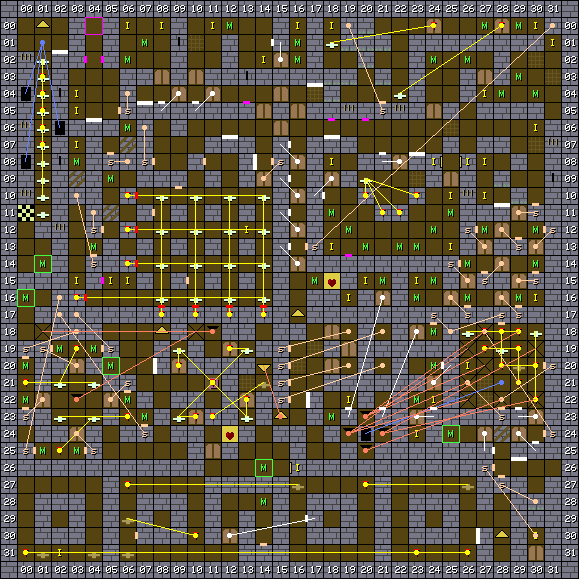

1. Table of Contents
{:toc}

### Map

### Key

### Wall messages

 Coords      | Message                 
-------------|-------------------------
 X: 02 Y: 02 | THE CONVEYOR OF LIFE
 X: 04 Y: 06 | HIT THE BUTTON WHEN READY FOR HELL
 X: 07 Y: 05 | THE GAME ROOMS
 X: 08 Y: 20 | GOLDEY LOCKS
 X: 12 Y: 07 | THE WORD IS SECRET
 X: 13 Y: 08 | YOU MAKE THE FIRE. CAN YOU STOP IT?
 X: 17 Y: 03 | ONLY PUSH THE RIGHT ONES
 X: 17 Y: 22 | DIZZY ROOMS
 X: 18 Y: 07 | THE MONSTER RAID
 X: 23 Y: 08 | BEWARE THE GUARDIANS
 X: 27 Y: 30 | HUNT FOR A SWITCH
 X: 28 Y: 11 | LET THEM OUT AND FACE THEM
 X: 29 Y: 25 | EVIL TO THE END

### Items

 Coords      | Item       
-------------|------------
 X: 02 Y: 31 | 60: GOLD KEY
 X: 03 Y: 04 | 27: GRAPES
 X: 03 Y: 05 | 28: BOILED EGG, 4b: WAND OF MAGIC
 X: 03 Y: 07 | 5f: IRON KEY
 X: 03 Y: 15 | 1e: BOOTS
 X: 05 Y: 15 | 5f: IRON KEY
 X: 06 Y: 00 | 60: GOLD KEY
 X: 06 Y: 15 | 24: APPLE (x2)
 X: 08 Y: 00 | 35: SHEATH
 X: 11 Y: 00 | 61: BRONZE KEY
 X: 13 Y: 12 | 04: CRASH HELMET +1, 0e: VEST +1
 X: 14 Y: 02 | 28: BOILED EGG (x2)
 X: 16 Y: 00 | 60: GOLD KEY
 X: 16 Y: 26 | 43: STAFF
 X: 18 Y: 00 | 0c: DENIM
 X: 18 Y: 08 | 5f: IRON KEY
 X: 18 Y: 13 | 1b: SANDLES
 X: 19 Y: 16 | 5f: IRON KEY
 X: 19 Y: 22 | 61: BRONZE KEY
 X: 20 Y: 15 | 60: GOLD KEY
 X: 23 Y: 15 | 61: BRONZE KEY
 X: 23 Y: 24 | 62: GEM KEY
 X: 24 Y: 08 | 4e: CROSS OF LIFE
 X: 24 Y: 22 | 62: GEM KEY
 X: 25 Y: 10 | 45: SHIELD
 X: 25 Y: 13 | 0e: VEST, 0c: DENIM
 X: 26 Y: 08 | 30: PENKNIFE, 55: BIG BOW
 X: 26 Y: 20 | 5f: IRON KEY
 X: 27 Y: 04 | 17: LEATHER
 X: 27 Y: 08 | 26: ROCK CAKE (x2)
 X: 27 Y: 10 | 36: FENCER
 X: 30 Y: 00 | 5f: IRON KEY
 X: 30 Y: 06 | 24: APPLE
 X: 30 Y: 16 | 0b: JUMPER +2, 0d: LEATHER
 X: 30 Y: 30 | 5f: IRON KEY
 X: 31 Y: 01 | 61: BRONZE KEY

### NPCs

 Coords      | Monster              | Defeated by            | Drops                  | Text
-------------|----------------------|------------------------|------------------------|--------
 X: 00 Y: 16 | 09: Giant            |                        | 5b: COIN               | STAY AWAY
 X: 01 Y: 14 | 07: Grey Knight      |                        | 64: STAR KEY           | LORDFEAR WILL DEFEAT YOU
 X: 05 Y: 20 | 09: Giant            |                        | 5b: COIN               | STAY AWAY
 X: 14 Y: 26 | 09: Giant            |                        | 5b: COIN               | STAY AWAY
 X: 25 Y: 24 | 09: Giant            |                        | 5b: COIN               | STAY AWAY

### Monsters

 Coords      | Monster              | HP     | Number
-------------|----------------------|--------|--------
 X: 00 Y: 16 | 09: Giant            |  1,500 | 1
 X: 00 Y: 20 | 07: Grey Knight      |    200 | 1
 X: 00 Y: 22 | 07: Grey Knight      |    300 | 1
 X: 01 Y: 14 | 07: Grey Knight      |  1,500 | 1
 X: 01 Y: 25 | 07: Grey Knight      |    300 | 1
 X: 02 Y: 19 | 07: Grey Knight      |    300 | 1
 X: 03 Y: 08 | 1b: Skeleton         |    680 | 1
 X: 03 Y: 25 | 07: Grey Knight      |    300 | 1
 X: 04 Y: 13 | 14: Lizardman        |    240 | 2
 X: 04 Y: 19 | 07: Grey Knight      |    200 | 1
 X: 05 Y: 09 | 13: Minotaur         |    390 | 2
 X: 05 Y: 20 | 09: Giant            |  1,300 | 1
 X: 06 Y: 02 | 14: Lizardman        |    420 | 1
 X: 06 Y: 06 | 12: Minotaur helmet  |    240 | 2
 X: 06 Y: 22 | 07: Grey Knight      |    300 | 1
 X: 07 Y: 01 | 13: Minotaur         |    390 | 1
 X: 07 Y: 23 | 07: Grey Knight      |    200 | 1
 X: 12 Y: 00 | 13: Minotaur         |    250 | 2
 X: 14 Y: 26 | 09: Giant            |  1,500 | 1
 X: 14 Y: 28 | 1d: Bat              |    400 | 4
 X: 16 Y: 01 | 15: Pharaoh          |    240 | 4
 X: 16 Y: 02 | 15: Pharaoh          |    250 | 3
 X: 17 Y: 15 | 1c: Ghost            |    120 | 1
 X: 18 Y: 11 | 1b: Skeleton         |    740 | 1
 X: 18 Y: 23 | 17: Cobra            |    600 | 1
 X: 19 Y: 12 | 1b: Skeleton         |    690 | 2
 X: 20 Y: 13 | 1b: Skeleton         |    580 | 2
 X: 21 Y: 15 | 17: Cobra            |    400 | 1
 X: 22 Y: 13 | 1b: Skeleton         |    660 | 3
 X: 23 Y: 13 | 1b: Skeleton         |    760 | 4
 X: 23 Y: 16 | 1b: Skeleton         |    740 | 1
 X: 23 Y: 22 | 17: Cobra            |    400 | 1
 X: 24 Y: 02 | 13: Minotaur         |    290 | 2
 X: 24 Y: 12 | 1b: Skeleton         |    510 | 2
 X: 24 Y: 15 | 1b: Skeleton         |    740 | 1
 X: 24 Y: 18 | 17: Cobra            |    500 | 1
 X: 24 Y: 20 | 17: Cobra            |    500 | 1
 X: 25 Y: 11 | 1b: Skeleton         |    360 | 3
 X: 25 Y: 24 | 09: Giant            |  1,300 | 1
 X: 26 Y: 02 | 13: Minotaur         |    890 | 1
 X: 26 Y: 14 | 13: Minotaur         |    340 | 1
 X: 26 Y: 16 | 14: Lizardman        |    500 | 3
 X: 27 Y: 00 | 12: Minotaur helmet  |    340 | 1
 X: 27 Y: 12 | 12: Minotaur helmet  |    240 | 1
 X: 28 Y: 04 | 14: Lizardman        |    440 | 2
 X: 29 Y: 00 | 12: Minotaur helmet  |    340 | 1
 X: 29 Y: 03 | 14: Lizardman        |    440 | 3
 X: 29 Y: 16 | 14: Lizardman        |    640 | 2
 X: 30 Y: 04 | 15: Pharaoh          |    340 | 3
 X: 30 Y: 12 | 12: Minotaur helmet  |    590 | 2
 X: 30 Y: 14 | 14: Lizardman        |    440 | 1

### Notes

The portal from the Forest spawns the party in at X: 04 Y: 00.

According to Quido's map to the game, the Ghost at X: 17 Y: 15 requires the
DISPELL spell.

Sections of this map are part of the Crown quest run. The ladder at X: 01 Y: 00
comes from a ladder at Crown level 1 X: 23 Y: 00, and leads to a passageway that
ends with a giant who drops a coin, although there are several such giants. The
second connection is at X: 28 Y: 30, and comes from the Crown level 2 at X: 06
Y: 26.
