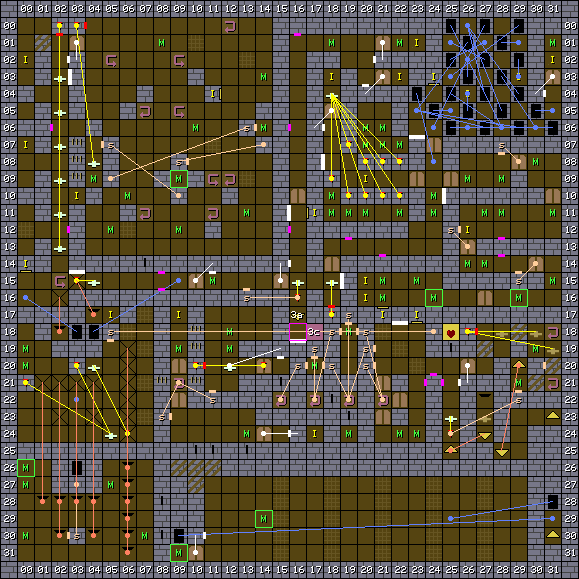

1. Table of Contents
{:toc}

### Map

### Key

### Wall messages

 Coords      | Message                 
-------------|-------------------------
 X: 03 Y: 03 | HUNT FOR GOLD
 X: 03 Y: 14 | REMEMBER TO HIDE
 X: 15 Y: 11 | THE SOUNDS OF HELL
 X: 16 Y: 19 | WHEN IS A WELL NOT A WELL
 X: 17 Y: 08 | BEWARE THE TRAP
 X: 19 Y: 15 | RUN AWAY!!!
 X: 22 Y: 17 | YOU ARE DESTINED TO DIE OF OLD AGE
 X: 23 Y: 07 | BREAD TRAILS ARE HANDY
 X: 25 Y: 10 | LOTS OF WORK

### Items

 Coords      | Item       
-------------|------------
 X: 00 Y: 02 | 36: FENCER
 X: 00 Y: 07 | 27: GRAPES, 24: APPLE
 X: 00 Y: 14 | 27: GRAPES (x2)
 X: 03 Y: 10 | 60: GOLD KEY
 X: 05 Y: 17 | 5c: CHEST #0
 X: 09 Y: 17 | 60: GOLD KEY
 X: 11 Y: 04 | 0e: VEST, 04: CRASH HELMET
 X: 17 Y: 11 | 50: STAFF OF OURA, 4c: WAND OF PAIN
 X: 17 Y: 24 | 5f: IRON KEY
 X: 18 Y: 03 | 62: GEM KEY
 X: 20 Y: 09 | 24: APPLE
 X: 20 Y: 15 | 61: BRONZE KEY
 X: 20 Y: 16 | 27: GRAPES
 X: 21 Y: 17 | 3d: ARROW (x3)
 X: 22 Y: 03 | 60: GOLD KEY
 X: 23 Y: 01 | 60: GOLD KEY
 X: 23 Y: 17 | 43: STAFF
 X: 24 Y: 03 | 40: PEA (x3), 57: PEA SHOOTER, 3f: DART (x3), 34: SHORT SWORD
 X: 26 Y: 04 | 28: BOILED EGG (x2)
 X: 26 Y: 12 | 26: ROCK CAKE, 28: BOILED EGG
 X: 29 Y: 03 | 5f: IRON KEY
 X: 31 Y: 02 | 63: RUSTY KEY

### NPCs

 Coords      | Monster              | Defeated by            | Drops                  | Text
-------------|----------------------|------------------------|------------------------|--------
 X: 00 Y: 26 | 10: Green dragon     |                        | 61: BRONZE KEY         | HOW DARE YOU ENTER
 X: 09 Y: 09 | 18: Acrobat          | 53: FUNNY STICK        | 5b: COIN               | I WILL PAY YOU
 X: 09 Y: 31 | 1a: Lord Fear        |                        | 08: CROWN OF GLORY     | THE CROWN IS MINE
 X: 14 Y: 29 | 1e: Demon            |                        | 64: STAR KEY           | HA HA HA HA
 X: 24 Y: 16 | 1d: Bat              |                        | 52: HEALSTONE          | WE WILL MAKE YOU ILL
 X: 29 Y: 16 | 15: Pharaoh          |                        | 53: FUNNY STICK        | DO NOT HIT ME

### Monsters

 Coords      | Monster              | HP     | Number
-------------|----------------------|--------|--------
 X: 00 Y: 19 | 19: Medusa           |    400 | 1
 X: 00 Y: 20 | 11: White Knight     |    600 | 4
 X: 00 Y: 26 | 10: Green dragon     |  1,500 | 1
 X: 00 Y: 27 | 1b: Skeleton         |    400 | 4
 X: 00 Y: 30 | 1b: Skeleton         |    400 | 2
 X: 04 Y: 09 | 20: Earth elemental  |    840 | 1
 X: 05 Y: 12 | 1f: Small dragon     |    290 | 1
 X: 05 Y: 27 | 1b: Skeleton         |    400 | 2
 X: 06 Y: 10 | 1f: Small dragon     |    290 | 1
 X: 07 Y: 30 | 11: White Knight     |  1,200 | 1
 X: 08 Y: 01 | 1f: Small dragon     |    390 | 1
 X: 09 Y: 09 | 18: Acrobat          | 16,000 | 1
 X: 09 Y: 12 | 1f: Small dragon     |    190 | 1
 X: 09 Y: 19 | 1b: Skeleton         |    450 | 4
 X: 09 Y: 31 | 1a: Lord Fear        |  4,100 | 1
 X: 10 Y: 06 | 1f: Small dragon     |    190 | 1
 X: 11 Y: 15 | 1d: Bat              |    120 | 4
 X: 12 Y: 18 | 11: White Knight     |    800 | 4
 X: 12 Y: 19 | 11: White Knight     |    700 | 4
 X: 13 Y: 11 | 1f: Small dragon     |    190 | 1
 X: 13 Y: 24 | 1b: Skeleton         |    350 | 4
 X: 14 Y: 03 | 1f: Small dragon     |    290 | 1
 X: 14 Y: 06 | 20: Earth elemental  |    740 | 1
 X: 14 Y: 29 | 1e: Demon            |  2,100 | 1
 X: 17 Y: 20 | 1b: Skeleton         |    340 | 4
 X: 18 Y: 01 | 17: Cobra            |    440 | 1
 X: 18 Y: 10 | 17: Cobra            |    280 | 1
 X: 18 Y: 11 | 17: Cobra            |    360 | 1
 X: 19 Y: 11 | 17: Cobra            |    450 | 1
 X: 19 Y: 18 | 1b: Skeleton         |    300 | 3
 X: 19 Y: 24 | 1b: Skeleton         |    300 | 3
 X: 20 Y: 06 | 17: Cobra            |    260 | 1
 X: 20 Y: 07 | 17: Cobra            |    280 | 1
 X: 20 Y: 11 | 17: Cobra            |    340 | 1
 X: 21 Y: 06 | 17: Cobra            |    370 | 1
 X: 21 Y: 07 | 17: Cobra            |    460 | 1
 X: 21 Y: 15 | 17: Cobra            |    440 | 1
 X: 21 Y: 16 | 1f: Small dragon     |    840 | 1
 X: 22 Y: 01 | 1f: Small dragon     |    840 | 1
 X: 22 Y: 07 | 17: Cobra            |    370 | 1
 X: 22 Y: 11 | 1d: Bat              |    280 | 3
 X: 22 Y: 24 | 1b: Skeleton         |    300 | 2
 X: 23 Y: 15 | 16: Sorcerer         |    340 | 1
 X: 23 Y: 24 | 1b: Skeleton         |    400 | 2
 X: 24 Y: 10 | 12: Minotaur helmet  |    440 | 1
 X: 24 Y: 11 | 13: Minotaur         |    540 | 1
 X: 24 Y: 16 | 1d: Bat              |    120 | 4
 X: 26 Y: 09 | 12: Minotaur helmet  |    240 | 4
 X: 26 Y: 14 | 16: Sorcerer         |    310 | 3
 X: 27 Y: 11 | 1d: Bat              |     90 | 3
 X: 27 Y: 14 | 15: Pharaoh          |    400 | 4
 X: 28 Y: 09 | 13: Minotaur         |    240 | 3
 X: 28 Y: 11 | 15: Pharaoh          |    390 | 2
 X: 29 Y: 16 | 15: Pharaoh          |    240 | 1
 X: 29 Y: 21 | 1c: Ghost            |    280 | 1
 X: 30 Y: 08 | 14: Lizardman        |    340 | 4
 X: 30 Y: 19 | 1c: Ghost            |    280 | 1
 X: 31 Y: 01 | 16: Sorcerer         |    440 | 1
 X: 31 Y: 11 | 16: Sorcerer         |    490 | 2
 X: 31 Y: 15 | 20: Earth elemental  |    840 | 1

### Notes

The top half of the map is Sword part 2. The bottom half is used for the Crown
quest, including the final battle with Lord Fear.

Quido's map for the game says that the door at X: 18 Y: 14 beside the sign "RUN
AWAY!!!" is destroyed by being hit with a fireball, triggered by the pressure
plate. A pressure plate at the crossroads locks you in, and the secret button to
the west unlocks it again.

The craziest section of the map is the teleporter maze. You need it to acquire
the Rusty Key and proceed ultimately to the enemies that drop the Funny Stick
and the Healstone. The well is operated by casting CURE on the HEALSTONE item -
the logic is that it makes you "well"... It teleports you to the third map.

The second part of the map during the Crown quest has ladders at X: 31 Y: 23 and
X: 31 Y: 30. These connect to Forest X: 25 Y: 23 and the first Crown level at X:
03 Y: 17, respectively. A portal from the puts you in a large area streaked with
grates and fighting a powerful boss which drops a Star Key, and then opening a
door will unleash Lord Fear, who has even more hit points.
