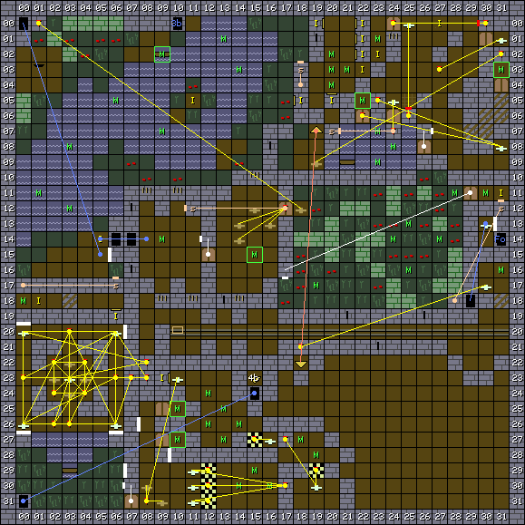

1. Table of Contents
{:toc}

### Map

### Key

### Wall messages

 Coords      | Message                 
-------------|-------------------------
 X: 00 Y: 19 | ALPHABET
 X: 00 Y: 27 | DOORS
 X: 06 Y: 15 | WELCOME TO THE DUNGEON
 X: 06 Y: 27 | BREACHES
 X: 07 Y: 20 | CLOSED
 X: 07 Y: 26 | THE ROOMS OF THE HEALERS
 X: 07 Y: 29 | RESET IN THE CENTRE
 X: 09 Y: 28 | TAKE YOUR TIME AND STAND BACK
 X: 31 Y: 13 | WELL DONE THE SWORD IS YOURS

### Items

 Coords      | Item       
-------------|------------
 X: 01 Y: 18 | 45: SHIELD
 X: 05 Y: 14 | 2a: MILK BOTTLE (x2)
 X: 06 Y: 19 | 59: RACKET
 X: 09 Y: 23 | 43: STAFF
 X: 11 Y: 05 | 61: BRONZE KEY
 X: 18 Y: 05 | 4f: STAFF OF MYSTIC, 3c: THROWING STAR (x3)
 X: 19 Y: 00 | 41: BALL (x4)
 X: 20 Y: 05 | 27: GRAPES, 24: APPLE (x3)
 X: 22 Y: 00 | 25: SPIDER'S LEG (x2)
 X: 22 Y: 01 | 38: BROADSWORD
 X: 22 Y: 02 | 04: CRASH HELMET +1, 18: CHAIN MAIL
 X: 22 Y: 03 | 5c: CHEST #2
 X: 23 Y: 02 | 60: GOLD KEY
 X: 27 Y: 00 | 5f: IRON KEY
 X: 31 Y: 11 | 39: SWORD OF FREEDOM

### NPCs

 Coords      | Monster              | Defeated by            | Drops                  | Text
-------------|----------------------|------------------------|------------------------|--------
 X: 09 Y: 02 | 05: Charon           | 5b: COIN               |                        | PAY ME
 X: 10 Y: 25 | 22: Wizard           |                        | 4d: CROSS OF AID       | I WILL HEAL YOU
 X: 10 Y: 27 | 23: Wizard           |                        | 4e: CROSS OF LIFE      | I WILL HEAL YOU
 X: 15 Y: 15 | 04: Witch            | 6f: POW (dummy item)   | 62: GEM KEY            | LEAVE NOW
 X: 22 Y: 05 | 0c: Spider           |                        | 25: SPIDER'S LEG       | SQWARK
 X: 31 Y: 03 | 0c: Spider           |                        | 25: SPIDER'S LEG       | SQWARK

### Monsters

 Coords      | Monster              | HP     | Number
-------------|----------------------|--------|--------
 X: 00 Y: 18 | 0e: Skull            |    940 | 1
 X: 01 Y: 11 | 21: Piranha          |    200 | 3
 X: 03 Y: 08 | 21: Piranha          |    200 | 4
 X: 03 Y: 12 | 21: Piranha          |    200 | 4
 X: 06 Y: 05 | 21: Piranha          |    200 | 4
 X: 09 Y: 02 | 05: Charon           | 65,000 | 1
 X: 09 Y: 07 | 21: Piranha          |    200 | 3
 X: 09 Y: 14 | 06: Cloaked figure   |  1,040 | 1
 X: 10 Y: 25 | 22: Wizard           |    100 | 1
 X: 10 Y: 27 | 23: Wizard           |    100 | 1
 X: 12 Y: 24 | 0b: Wizard           |  1,200 | 1
 X: 12 Y: 26 | 0b: Wizard           |  1,200 | 1
 X: 13 Y: 01 | 21: Piranha          |    100 | 2
 X: 13 Y: 25 | 0b: Wizard           |  1,300 | 1
 X: 13 Y: 27 | 0b: Wizard           |  1,100 | 1
 X: 14 Y: 03 | 21: Piranha          |    130 | 3
 X: 14 Y: 26 | 0b: Wizard           |  1,000 | 1
 X: 14 Y: 30 | 0b: Wizard           |    800 | 1
 X: 15 Y: 15 | 04: Witch            |  1,610 | 1
 X: 15 Y: 29 | 0b: Wizard           |    800 | 1
 X: 16 Y: 30 | 0b: Wizard           |  1,800 | 1
 X: 18 Y: 27 | 0b: Wizard           |    900 | 1
 X: 19 Y: 17 | 0e: Skull            |    580 | 2
 X: 19 Y: 28 | 0b: Wizard           |    800 | 1
 X: 20 Y: 02 | 03: Troll            |    290 | 1
 X: 20 Y: 03 | 0e: Skull            |    580 | 2
 X: 20 Y: 04 | 0e: Skull            |    460 | 3
 X: 21 Y: 03 | 0e: Skull            |    690 | 4
 X: 22 Y: 05 | 0c: Spider           |    800 | 1
 X: 23 Y: 01 | 0d: Ant              |    425 | 4
 X: 23 Y: 07 | 21: Piranha          |    200 | 4
 X: 23 Y: 09 | 21: Piranha          |    200 | 4
 X: 24 Y: 08 | 21: Piranha          |    200 | 4
 X: 24 Y: 14 | 0e: Skull            |    540 | 1
 X: 25 Y: 13 | 08: Pooka            |    870 | 1
 X: 25 Y: 16 | 08: Pooka            |    740 | 1
 X: 27 Y: 14 | 08: Pooka            |    840 | 1
 X: 28 Y: 11 | 0e: Skull            |    440 | 3
 X: 30 Y: 11 | 04: Witch            |  1,200 | 1
 X: 31 Y: 03 | 0c: Spider           |    685 | 1
 X: 31 Y: 16 | 0a: Wizard           |    600 | 1

### Notes

The witch at X: 15 Y: 15 is coded to be defeated instantly by item 6F, but that
item number is a dummy item with a "POW" sprite.

There's an interesting Treguard message at X: 09: Y: 28 - "TAKE YOUR TIME AND
STAND BACK" - which is coded to be facing the wrong direction, so it can't be
seen.
