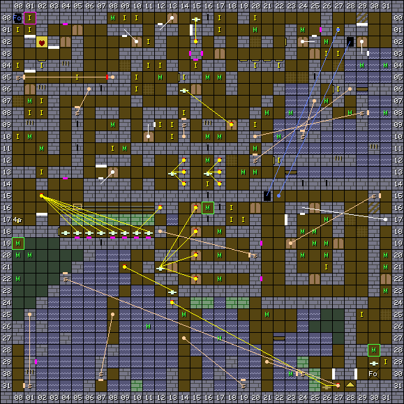

1. Table of Contents
{:toc}

### Map

### Key

### Wall messages

 Coords      | Message                 
-------------|-------------------------
 X: 01 Y: 02 | YOUR QUEST FOR THE SHIELD HAS BEGUN
 X: 01 Y: 04 | DO NOT PLAY WITH FIRE
 X: 02 Y: 17 | TARGET PRACTICE
 X: 03 Y: 02 | THE SPRIG OF LIFE AND DEATH
 X: 07 Y: 12 | SEWER ENTERANCE
 X: 15 Y: 01 | KEEP THE PAD DOWN
 X: 23 Y: 17 | THE PRISON
 X: 27 Y: 30 | KEEP OUT PRIVATE POOLS
 X: 28 Y: 30 | WELL DONE! QUEST ONE COMPLETED
 X: 29 Y: 01 | THE HOME OF MR CHILD

### Items

 Coords      | Item       
-------------|------------
 X: 00 Y: 01 | 22: SWEET
 X: 00 Y: 04 | 5f: IRON KEY
 X: 00 Y: 10 | 5f: IRON KEY
 X: 01 Y: 00 | 13: SHORTS
 X: 01 Y: 01 | 09: T-SHIRT
 X: 01 Y: 08 | 30: PENKNIFE
 X: 02 Y: 04 | 4f: STAFF OF MYSTIC, 4d: CROSS OF AID
 X: 02 Y: 07 | 22: SWEET
 X: 02 Y: 08 | 5f: IRON KEY
 X: 02 Y: 13 | 30: PENKNIFE
 X: 05 Y: 05 | 0a: BLOUSE
 X: 08 Y: 11 | 22: SWEET
 X: 09 Y: 00 | 31: KNIFE
 X: 10 Y: 00 | 22: SWEET
 X: 10 Y: 05 | 57: PEA SHOOTER
 X: 10 Y: 06 | 0a: BLOUSE +1
 X: 11 Y: 02 | 15: SLACKS
 X: 11 Y: 04 | 32: THREE PRONGED KNIFE
 X: 12 Y: 04 | 22: SWEET, 14: SKIRT +2
 X: 12 Y: 09 | 22: SWEET
 X: 13 Y: 09 | 22: SWEET
 X: 13 Y: 10 | 3e: DART
 X: 14 Y: 05 | 0b: JUMPER, 60: GOLD KEY
 X: 14 Y: 08 | 14: SKIRT +1
 X: 15 Y: 04 | 1b: SANDLES
 X: 16 Y: 14 | 58: BLOWPIPE
 X: 17 Y: 00 | 5f: IRON KEY
 X: 17 Y: 01 | 1b: SANDLES
 X: 18 Y: 16 | 5f: IRON KEY
 X: 18 Y: 17 | 3e: DART (x3)
 X: 19 Y: 17 | 40: PEA (x3)
 X: 20 Y: 00 | 3b: ROCK (x2)
 X: 20 Y: 04 | 14: SKIRT
 X: 20 Y: 09 | 32: THREE PRONGED KNIFE
 X: 22 Y: 04 | 09: T-SHIRT, 13: SHORTS, 02: BASEBALL HAT
 X: 22 Y: 12 | 25: SPIDER'S LEG
 X: 26 Y: 03 | 31: KNIFE
 X: 26 Y: 21 | 3b: ROCK
 X: 27 Y: 01 | 22: SWEET
 X: 27 Y: 03 | 40: PEA (x4)
 X: 27 Y: 06 | 61: BRONZE KEY
 X: 29 Y: 25 | 33: KITCHEN KNIFE
 X: 31 Y: 29 | 46: SHIELD OF JUSTICE

### NPCs

 Coords      | Monster              | Defeated by            | Drops                  | Text
-------------|----------------------|------------------------|------------------------|--------
 X: 00 Y: 19 | 04: Witch            |                        | 5f: IRON KEY           | HE HE HE HE HE
 X: 16 Y: 16 | 22: Wizard           |                        | 4d: CROSS OF AID       | I WILL HEAL YOU
 X: 30 Y: 28 | 03: Troll            |                        |                        | NO ONE WILL PASS

### Monsters

 Coords      | Monster              | HP     | Number
-------------|----------------------|--------|--------
 X: 00 Y: 19 | 04: Witch            |  1,500 | 1
 X: 00 Y: 20 | 04: Witch            |    500 | 1
 X: 00 Y: 22 | 04: Witch            |    500 | 1
 X: 01 Y: 07 | 00: Goblin           |     30 | 1
 X: 01 Y: 10 | 00: Goblin           |     60 | 4
 X: 01 Y: 20 | 04: Witch            |    500 | 1
 X: 02 Y: 11 | 01: Tree             |     90 | 4
 X: 08 Y: 00 | 00: Goblin           |     40 | 1
 X: 08 Y: 09 | 00: Goblin           |     60 | 4
 X: 09 Y: 11 | 00: Goblin           |     60 | 4
 X: 11 Y: 26 | 21: Piranha          |    500 | 4
 X: 12 Y: 05 | 01: Tree             |     80 | 4
 X: 14 Y: 25 | 06: Cloaked figure   |    600 | 1
 X: 16 Y: 05 | 00: Goblin           |     50 | 3
 X: 16 Y: 10 | 00: Goblin           |     60 | 2
 X: 16 Y: 12 | 00: Goblin           |    150 | 4
 X: 16 Y: 16 | 22: Wizard           |    135 | 1
 X: 17 Y: 05 | 00: Goblin           |     50 | 3
 X: 17 Y: 10 | 00: Goblin           |     50 | 3
 X: 17 Y: 18 | 0a: Wizard           |  1,535 | 1
 X: 17 Y: 20 | 0a: Wizard           |  1,435 | 1
 X: 17 Y: 22 | 0a: Wizard           |  1,535 | 1
 X: 17 Y: 27 | 21: Piranha          |    400 | 4
 X: 19 Y: 13 | 00: Goblin           |    140 | 4
 X: 20 Y: 01 | 00: Goblin           |     50 | 2
 X: 20 Y: 11 | 03: Troll            |    200 | 4
 X: 20 Y: 13 | 00: Goblin           |    140 | 4
 X: 21 Y: 08 | 03: Troll            |    200 | 2
 X: 21 Y: 25 | 06: Cloaked figure   |    600 | 1
 X: 22 Y: 10 | 21: Piranha          |     80 | 1
 X: 23 Y: 08 | 21: Piranha          |     70 | 1
 X: 23 Y: 30 | 21: Piranha          |    400 | 4
 X: 24 Y: 01 | 00: Goblin           |     50 | 2
 X: 24 Y: 18 | 00: Goblin           |     75 | 4
 X: 24 Y: 20 | 01: Tree             |    225 | 4
 X: 25 Y: 18 | 00: Goblin           |     85 | 4
 X: 25 Y: 19 | 03: Troll            |     95 | 4
 X: 26 Y: 02 | 03: Troll            |    140 | 1
 X: 26 Y: 07 | 03: Troll            |    200 | 4
 X: 26 Y: 17 | 01: Tree             |    225 | 4
 X: 26 Y: 19 | 00: Goblin           |    115 | 4
 X: 26 Y: 20 | 03: Troll            |    125 | 4
 X: 28 Y: 08 | 03: Troll            |    260 | 4
 X: 29 Y: 04 | 21: Piranha          |     60 | 3
 X: 30 Y: 28 | 03: Troll            |    800 | 1
 X: 31 Y: 04 | 21: Piranha          |     70 | 2
 X: 31 Y: 08 | 21: Piranha          |     80 | 2
 X: 31 Y: 20 | 03: Troll            |    135 | 4
 X: 31 Y: 21 | 03: Troll            |    235 | 4
 X: 31 Y: 23 | 06: Cloaked figure   |    935 | 1

### Notes

This is the first dungeon in the game.
