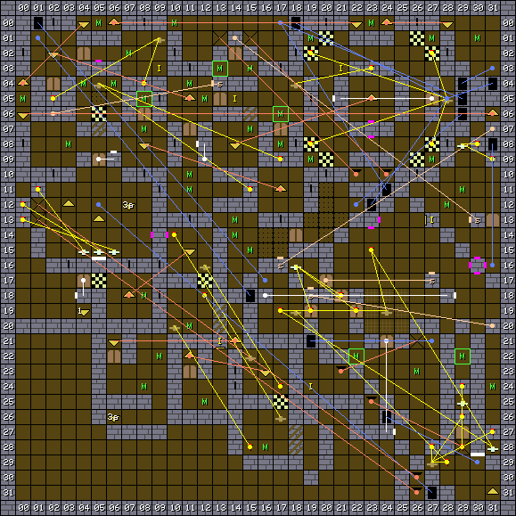

1. Table of Contents
{:toc}

### Map

### Key

### Wall messages

 Coords      | Message                 
-------------|-------------------------
 X: 05 Y: 16 | RETURN THE THREE STAFFS
 X: 30 Y: 28 | THE ROUTE TO THE CASTLE OF FEAR

### Items

 Coords      | Item       
-------------|------------
 X: 09 Y: 03 | 19: PLATE
 X: 13 Y: 21 | 11: PLATE
 X: 14 Y: 05 | 20: PLATE, 10: PLATE
 X: 19 Y: 24 | 2a: MILK BOTTLE (x2), 5c: CHEST #1
 X: 21 Y: 03 | 06: HELM +1, 06: HELM +2
 X: 27 Y: 13 | 06: HELM +2

### NPCs

 Coords      | Monster              | Defeated by            | Drops                  | Text
-------------|----------------------|------------------------|------------------------|--------
 X: 08 Y: 05 | 07: Grey Knight      |                        | 61: BRONZE KEY         | 
 X: 13 Y: 03 | 07: Grey Knight      |                        | 63: RUSTY KEY          | 
 X: 17 Y: 06 | 07: Grey Knight      |                        | 61: BRONZE KEY         | 
 X: 22 Y: 22 | 07: Grey Knight      |                        | 61: BRONZE KEY         | I WANT TO BE THE GUARDIAN OF THE CASTLE
 X: 29 Y: 22 | 07: Grey Knight      |                        | 61: BRONZE KEY         | I AM THE GUARDIAN OF THE CASTLE

### Monsters

 Coords      | Monster              | HP     | Number
-------------|----------------------|--------|--------
 X: 00 Y: 05 | 1c: Ghost            |  1,035 | 1
 X: 03 Y: 08 | 1b: Skeleton         |    935 | 2
 X: 04 Y: 04 | 1b: Skeleton         |    935 | 2
 X: 05 Y: 00 | 1c: Ghost            |    135 | 1
 X: 06 Y: 04 | 1b: Skeleton         |    935 | 4
 X: 07 Y: 02 | 1b: Skeleton         |    935 | 3
 X: 08 Y: 05 | 07: Grey Knight      |  2,435 | 1
 X: 08 Y: 07 | 1b: Skeleton         |    935 | 2
 X: 08 Y: 18 | 19: Medusa           |    500 | 9
 X: 08 Y: 24 | 1e: Demon            |  1,400 | 1
 X: 09 Y: 22 | 1e: Demon            |  1,300 | 1
 X: 10 Y: 00 | 19: Medusa           |    735 | 1
 X: 11 Y: 04 | 09: Giant            |  1,935 | 1
 X: 11 Y: 10 | 09: Giant            |  2,135 | 1
 X: 11 Y: 11 | 09: Giant            |  1,935 | 1
 X: 11 Y: 20 | 1e: Demon            |  1,000 | 1
 X: 12 Y: 05 | 09: Giant            |  1,935 | 1
 X: 12 Y: 25 | 1e: Demon            |  1,200 | 1
 X: 13 Y: 03 | 07: Grey Knight      |  2,135 | 1
 X: 14 Y: 13 | 19: Medusa           |     35 | 1
 X: 14 Y: 14 | 19: Medusa           |     35 | 1
 X: 15 Y: 03 | 07: Grey Knight      |    235 | 1
 X: 15 Y: 07 | 1c: Ghost            |    935 | 1
 X: 15 Y: 15 | 09: Giant            |  2,335 | 1
 X: 16 Y: 28 | 1e: Demon            |  1,000 | 1
 X: 17 Y: 06 | 07: Grey Knight      |  2,435 | 1
 X: 17 Y: 08 | 09: Giant            |  2,935 | 1
 X: 19 Y: 01 | 07: Grey Knight      |  3,135 | 1
 X: 19 Y: 09 | 07: Grey Knight      |  3,135 | 1
 X: 22 Y: 22 | 07: Grey Knight      |  2,035 | 1
 X: 23 Y: 00 | 1c: Ghost            |  1,035 | 1
 X: 26 Y: 23 | 07: Grey Knight      |  1,635 | 1
 X: 27 Y: 01 | 07: Grey Knight      |  3,135 | 1
 X: 27 Y: 09 | 07: Grey Knight      |  3,135 | 1
 X: 28 Y: 12 | 19: Medusa           |    335 | 1
 X: 29 Y: 11 | 19: Medusa           |    335 | 1
 X: 29 Y: 22 | 07: Grey Knight      |  3,435 | 1
 X: 30 Y: 01 | 1c: Ghost            |  1,035 | 1
 X: 31 Y: 24 | 07: Grey Knight      |  1,635 | 1

### Notes

The ladder at X: 31 Y: 31 is connected to Crown level 1 X: 07 Y: 11.

The Crown quest continues through sections of numerous other maps.
