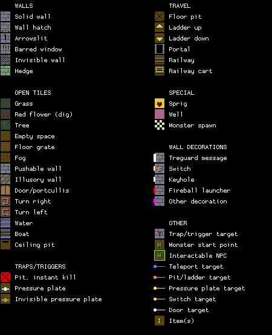

1. Table of Contents
{:toc}

### Map

### Key

### Wall messages

 Coords      | Message                 
-------------|-------------------------
 X: 00 Y: 02 | THE TRAINING ROOMS

### Items

 Coords      | Item       
-------------|------------
 X: 03 Y: 15 | 12: AQUALUNG
 X: 05 Y: 13 | 3a: CHAIN SAW
 X: 06 Y: 00 | 20: PLATE, 19: PLATE
 X: 09 Y: 05 | 50: STAFF OF OURA, 4e: CROSS OF LIFE, 4c: WAND OF PAIN
 X: 11 Y: 01 | 04: CRASH HELMET +2, 05: HELM
 X: 11 Y: 30 | 27: GRAPES
 X: 13 Y: 01 | 27: GRAPES (x10)
 X: 13 Y: 04 | 44: SPANNER, 51: SKULL OF STATUS
 X: 13 Y: 17 | 3d: ARROW (x5)
 X: 13 Y: 29 | 27: GRAPES
 X: 15 Y: 01 | 06: HELM, 10: PLATE
 X: 15 Y: 07 | 3a: CHAIN SAW
 X: 16 Y: 30 | 27: GRAPES
 X: 18 Y: 20 | 28: BOILED EGG (x2)
 X: 20 Y: 25 | 28: BOILED EGG (x3)
 X: 20 Y: 29 | 27: GRAPES
 X: 23 Y: 14 | 3c: THROWING STAR (x5)
 X: 23 Y: 19 | 56: CROSS BOW, 3d: ARROW (x4)
 X: 24 Y: 30 | 18: CHAIN MAIL, 0f: CHAIN MAIL, 0e: VEST +1, 1f: BOOTS
 X: 25 Y: 24 | 11: PLATE, 06: HELM +2
 X: 31 Y: 06 | 59: RACKET, 3d: ARROW (x3), 41: BALL (x5)

### NPCs

 Coords      | Monster              | Defeated by            | Drops                  | Text
-------------|----------------------|------------------------|------------------------|--------
 X: 02 Y: 20 | 11: White Knight     |                        | 47: TWIG               | ONE IS THE EXIT
 X: 18 Y: 07 | 11: White Knight     |                        | 62: GEM KEY            | LEAVE ME IN PIECES
 X: 26 Y: 03 | 10: Green dragon     | 34: SHORT SWORD        | 38: BROADSWORD         | LET ME SEE YOUR SWORD
 X: 30 Y: 27 | 09: Giant            |                        | 63: RUSTY KEY          | I KNOW WHERE THE KEY IS
 X: 31 Y: 30 | 10: Green dragon     |                        | 62: GEM KEY            | 

### Monsters

 Coords      | Monster              | HP     | Number
-------------|----------------------|--------|--------
 X: 00 Y: 11 | 1e: Demon            |    800 | 1
 X: 01 Y: 10 | 1e: Demon            |    400 | 1
 X: 01 Y: 11 | 1e: Demon            |    800 | 1
 X: 01 Y: 12 | 1e: Demon            |    600 | 1
 X: 01 Y: 14 | 1e: Demon            |    500 | 1
 X: 02 Y: 10 | 1e: Demon            |    300 | 1
 X: 02 Y: 11 | 1e: Demon            |    700 | 1
 X: 02 Y: 12 | 1e: Demon            |    700 | 1
 X: 02 Y: 14 | 1e: Demon            |    500 | 1
 X: 02 Y: 20 | 11: White Knight     |  1,435 | 1
 X: 03 Y: 13 | 1e: Demon            |    600 | 1
 X: 05 Y: 26 | 10: Green dragon     |  1,135 | 1
 X: 06 Y: 20 | 11: White Knight     |  1,335 | 1
 X: 07 Y: 29 | 10: Green dragon     |  1,135 | 1
 X: 07 Y: 31 | 10: Green dragon     |  1,135 | 1
 X: 08 Y: 21 | 11: White Knight     |  1,135 | 2
 X: 10 Y: 29 | 11: White Knight     |  1,135 | 2
 X: 11 Y: 04 | 1f: Small dragon     |    935 | 1
 X: 13 Y: 02 | 1f: Small dragon     |    935 | 1
 X: 14 Y: 17 | 20: Earth elemental  |    735 | 3
 X: 14 Y: 25 | 11: White Knight     |  1,135 | 2
 X: 15 Y: 04 | 1f: Small dragon     |  1,135 | 1
 X: 16 Y: 15 | 20: Earth elemental  |    735 | 3
 X: 16 Y: 17 | 20: Earth elemental  |    735 | 3
 X: 17 Y: 02 | 1f: Small dragon     |  1,335 | 1
 X: 17 Y: 11 | 11: White Knight     |    935 | 2
 X: 18 Y: 07 | 11: White Knight     |  1,135 | 1
 X: 18 Y: 11 | 11: White Knight     |  1,135 | 2
 X: 18 Y: 26 | 10: Green dragon     |  2,135 | 1
 X: 19 Y: 04 | 1f: Small dragon     |  1,235 | 1
 X: 19 Y: 11 | 11: White Knight     |  1,135 | 3
 X: 19 Y: 19 | 11: White Knight     |  1,135 | 3
 X: 21 Y: 01 | 1f: Small dragon     |    935 | 1
 X: 25 Y: 05 | 1f: Small dragon     |  1,135 | 1
 X: 25 Y: 06 | 1f: Small dragon     |  1,135 | 1
 X: 26 Y: 03 | 10: Green dragon     |  3,435 | 1
 X: 26 Y: 06 | 1f: Small dragon     |    235 | 1
 X: 26 Y: 23 | 1b: Skeleton         |    935 | 3
 X: 26 Y: 26 | 1b: Skeleton         |    835 | 2
 X: 27 Y: 06 | 1f: Small dragon     |  1,135 | 1
 X: 27 Y: 25 | 1b: Skeleton         |    535 | 3
 X: 27 Y: 27 | 1b: Skeleton         |    835 | 4
 X: 28 Y: 28 | 1f: Small dragon     |  1,135 | 1
 X: 28 Y: 29 | 1f: Small dragon     |  1,135 | 1
 X: 28 Y: 30 | 1f: Small dragon     |    935 | 1
 X: 28 Y: 31 | 1f: Small dragon     |    935 | 1
 X: 29 Y: 11 | 1f: Small dragon     |    935 | 1
 X: 29 Y: 29 | 1f: Small dragon     |  1,035 | 1
 X: 29 Y: 30 | 1f: Small dragon     |  1,035 | 1
 X: 29 Y: 31 | 1f: Small dragon     |    635 | 1
 X: 30 Y: 27 | 09: Giant            |  3,235 | 1
 X: 30 Y: 29 | 1f: Small dragon     |    635 | 1
 X: 30 Y: 30 | 1f: Small dragon     |    835 | 1
 X: 30 Y: 31 | 1f: Small dragon     |  1,035 | 1
 X: 31 Y: 29 | 1f: Small dragon     |    735 | 1
 X: 31 Y: 30 | 10: Green dragon     |  3,135 | 1
 X: 31 Y: 31 | 1f: Small dragon     |    735 | 1

### Notes

You spawn in at X: 01 Y: 03.
